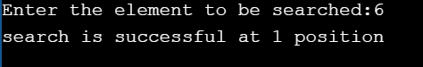
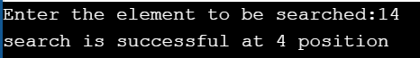

#AIM OF THE EXPERIMENT: To find the element in the given array by using binary search logic with out recursion(iterative)

DESCRIPTION:
1. Binary search works on sorted arrays.
2. Binary search beguns by comparing an element in the middle of the array with the target value.
3. If target value matches the element it returns the position of the array.
4. If the target value is less than the element,the search continues in the lower half of the array.
5. If the target value is greater than the element, the search continues in the upper half of the array.
6. By doing this the algorithn eliminates the half in which the target value can not lie in each iteration.

### STEP BY STEP PROCEDURE:
1. We have the array a[10] = {10,6,8,15,20,3,14,99,66,30}.
2. By sorting the array we get a[10] = {3,6,8,10,14,15,20,30,66,99}.
3. Consider a key element from the given array.
4. Here the low position is 0 and high position is 9.
5. We need to find the mid value as (low + high)/2.
6. Here there are 3 cases:
   case 1: if the mid = key,it returns the mid position.
   case 2: if key > mid, then low = mid + 1.
   case 3: if key < mid, then high = mid -1.
7. We have to continue our process until we find the key element or search space is exhausted

output 1:(key element = 6)
 * STEP 1: first index = 0, last index = 9, mid index = 4
   a[4] = 20 and a[4] > 6
 * STEP 2: first index = 0 , last index = 3 ,mid value = 2
 a[2] = 8 and a[2] > 6
 * STEP 3: first index = 0, last index = 
    
    
    
output 2:
    key element is 14, then mid = (0+9)/2 = 4.5,here key > mid then low = mid + 1 and continues untill the key element matches with mid position,then we will find that search is successful at 4th position in the array.
    
    
output 3:
    key element is 99, then mid = (0+9)/2 = 4.5,here key > mid then low = mid + 1 and continues untill the key element matches with mid position,then we will find that search is successful at 9th position in the array.
    
