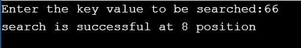
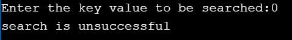

#AIM OF THE EXPERIMENT: To find an element in array using linear search with recursion.

##DESCRIPTION: We have to write a c peogram to find whether the element is present in an array or not by using Reclinearsearch function and to find out the position of the element in the array.

### STEP BY STEP PROCEDURE:
output 1(if the input is 66) : When the user inputs the key value to be searched as 66,then the out put is obtained as the search is successful at position 8.

1. declare a function Reclinearsearch which takes 4 input parameters and returns position of an element which is searched by the user.
2. create an array and input the velements of the array and scan the value of the key element to be found
5. We initialise a for loop and we check if the element is equal to the key value by calling Reclinearsearch function.
3. In the process of iteration we check if the element and the key value that we need to be searched is same or not
. In the iteration 1 a[0] = 10 and the key value is 66. As both are not equal and the case fails.
. In the iteration 2 a[1] = 6 and the key value is 6.As both are not equal and the case fails.
. In the iteration 3 a[2] = 8 and the key value is 8.As both are not equal and the case fails.
. similarly iteration continues until the element matches with the key value.
. In iteration 9 a[8] = 66 which is equal to the required key value.

output 2(if the input is 0) : When the user inputs the key value to be searched as 0,then the out put is obtained as the search is unsuccessful.

1. declare a function Reclinearsearch which takes 4 input paramters and returns position of an element which is searched by the usewr.
2. create an array and input the elements of the array and scan the value of the key element to be found.
3. We initialise a for loop and we check if the element is equal to the key value by calling a Reclinearsearch function
4. as zero not present in the elements of the array it returns the search is unsuccessful

