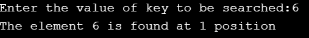
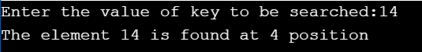

AIM OF THE EXPERIMENT: To perform binary search on a given array.

DESCRIPTION:
1. Binary search works on sorted arrays.
2. Binary search begins by comparing an element in the middle of the array with the target value.
3. If the target value is matched with the element in the array,then it returns the position of the element in the array.
4. If the target value is less than the element,the search continues in the lower half of the array.
5. If the target value is greater than the element,the search continues in the upper half of the array.
6. By doing this the algorithm eliminates the halfin which the target value can not lie in each iteration.

STEP BY STEP PROCEDURE:
1. we have the array a[10] = {10,6,8,15,20,3,14,99,66,30}
2. By sorting the array we get a[10] = {3,6,8,10,14,15,20,30,66,99}
3. Consider a key element from the given array.
4. Here the low position is 0 and the high position is 9.
5. The mid value is mid = (low + high)/2.
6. We need to compare the key value and mid value by calling the user function.
7. Here 3 cases are there
    case 1: If the mid = key element then return mid position
    case 2: If key > mid then low = mid + 1.
    case 3: If key < mid then high = mid -1.
8. We have to continue this process until we find our key element.

output 1:key element is 6,then mid = (0+9)/2=4.5.Here mid <key then high = mid -1 and continues until the key element matches with mid position by declaring a recursive function then we will find the key position at 1 st position of the array.

output 2:key element is 14, then mid = (0+9)/2 = 4.5.Here mid > key then low = mid +1 and continues until the key element matches with the position by declaring a recursive function then we wil find key position at  4th position in the array.

output 3:key element is 99,then mid = (0+9)/2 = 4.5.Here mid < key then high = mid -1 and continues until the key element matches with mid position by declaring a recursive function then we will find the key position at 9th position.

