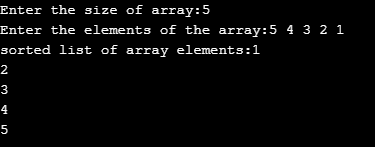
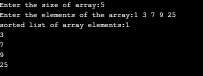

AIM OR THE EXPERIMENT:

      Arranging the given elements in ascending order when an unsorted array is given by using Bubble sort technique.
	  
DESCRIPTION:

STEP BY STEP PROCEDURE:
    
    1. Firstly, we have to declare an array with specific number of elements.
	
    2. Then we have to compare the adjacent two elements strating from the first position.
	
	3. If the first element is greater than second element we have to swap them.Otherwise, we have to consider next two adjacent elements for the comparision.
	
	4. This process continues until the whole array gets sortetd.
	
	5. If the array gets sorted then we have to print the array.
	
OUTPUT OBTAINED:
 
    OUTPUT 1:  
	 
	1. We are initializing the array with size of 5.
	   
	2. Let the array be { 5, 4, 3, 2, 1 }.If there are n elements in the array then we require n -1 passes for sorting the array.
	   
	3. For the first pass: Here compare for the first two elements 5 and 4.Hence 5 is > 4,then swap(5, 4) occurs and the array becomes  { 4, 5, 3, 2, 1 }.
	   
	4. By comparing the 2nd and 3rd elements 5 and 3. Hencde 5 is greater tha 3, then swap(5, 3) occurs and the array becomes { 4, 3, 5, 2, 1 }.
	   
	5. By comparing the 3rd and 4th elements  5 and 2. Hence 5 is greater than 2, then swap(5, 2) occurs and the array becomes {4, 3, 2, 5, 1 }.
	   
	6. By comparing the 4th and 5th elements 5 and 1. Hence 5 is greater than 1, then swap (5, 1) occurs and the array becomes { 4, 3, 2, 1, 5}.
	   
	7. For second pass the array becomes {3, 2, 1, 4, 5]. For the 3rd pass the array becomes { 2, 1, 3, 4, 5}. For the 4th pass the array becomes {1, 2, 3, 4, 5}.
	   
	8. And the given array got sorted by using swapping.
	   
	   
	   
	OUTPUT 2:
	
	1. we are initializing the array with size of 10. And the array is {5,6,7,8,9,2,10,-3,15,25}.
	
	2. For firts pass the array becomes {5,6,7,2,8,9,-3,10,15,25}.For the second pass the array becomes {5,6,7,2,8,-3,9,10,15,25}.For 3rd pass array becomes {5,6,7,2,-3,8,9,10,15,25}.
	
	3. For the 4th pass array becomes {5,6,2,-3,7,8,9,10,15,25}.For 5th pass arry becomes {5,2,6,-3,7,8,9,10,15,25}.For 6th pass array becomes {5,2,-3,6,7,8,9,10,15,25}.
	
	4. For the 7th pass array becomes {5,-3,2,6,7,8,9,10,15,25}.For 8th pass array becomes {-3,5,2,6,7,8,9,10,15,25}.For 9th pass array becomes {-3,2,5,6,7,8,9,10,15,25].
	
	5. And the given array got sorted.
	
	 
	 
	 
	 
	OuTPUT 3:
	
	1. We are initializing the array with size 5 and the array is {1,3, 7, 9, 25}.
	
	2. the given array is sorted hence no need of swapping.
	
	
